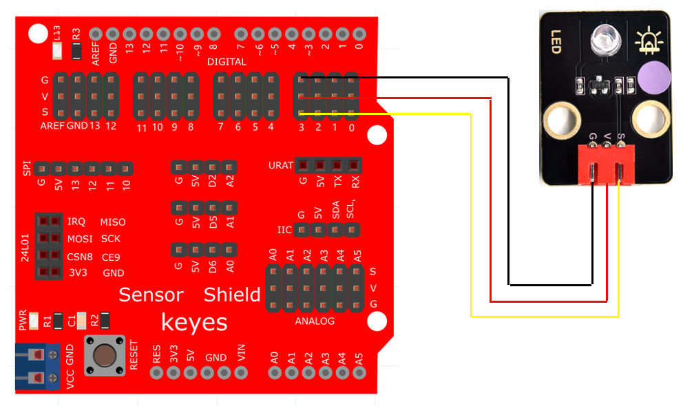

# Arduino


## 1. Arduino简介  

Arduino是一个开源电子原型平台，旨在为电子爱好者和开发者提供一个易于使用的开发环境。Arduino平台具有灵活性和可扩展性，支持多种传感器、执行器和模块的连接。用户可以通过Arduino IDE编写程序，利用Arduino开发板控制各种设备，从简单的LED闪烁到复杂的机器人控制。  

Arduino的核心是其微控制器，这些微控制器负责执行用户编写的代码。Arduino同时支持C/C++编程和Scratch图形编程，适合不同水平的学习者。它的广泛应用技术领域包括物联网、自动化控制、机器人、环境监测等。  

## 2. 连接图  

  

## 3. 测试代码（LED闪烁）  

```cpp  
int led = 3; // 定义数字口3为LED引脚  

void setup() {  
  pinMode(led, OUTPUT); // 设置led为输出  
}  

void loop() {  
  digitalWrite(led, HIGH); // 开启LED  
  delay(2000); // 延迟2秒  
  digitalWrite(led, LOW); // 关闭LED  
  delay(2000); // 延迟2秒  
}  
```  

## 4. 测试结果  

烧录好测试代码后，按照接线图连接好线；上电后，LED模块上的LED会进行闪烁，亮起2秒，熄灭2秒，循环交替进行。  

## 5. 加强训练（呼吸灯）  

在这个训练中，我们将使用PWM（脉宽调制）来控制LED的亮度，模拟出呼吸灯效果。PWM信号通过调节宽度来控制LED的亮度变化。  

## 6. PWM控制代码（呼吸灯效果）  

```cpp  
int ledPin = 3; // 定义LED接口为PWM数字口3  

void setup() {  
  pinMode(ledPin, OUTPUT); // 初始化led引脚为输出模式  
}  

void loop() {  
  for (int value = 0; value < 255; value++) {  
    analogWrite(ledPin, value); // LED逐渐变亮  
    delay(10); // 延迟10毫秒  
  }  
  for (int value = 255; value > 0; value--) {  
    analogWrite(ledPin, value); // LED逐渐变暗  
    delay(10); // 延迟10毫秒  
  }  
}  
```  

## 7. 结果  

上传代码后，LED会逐渐从暗变亮，然后再逐渐变暗，模拟出呼吸灯效果。通过这种方式，用户能够直观体验到LED的亮度变化，提升了项目的趣味性。


