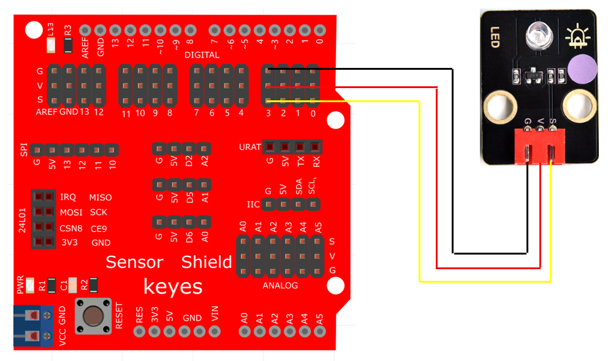

# KidsBlock

## 1. Kidsblock简介  

Kidsblock是一个面向儿童和初学者的可视化编程平台，旨在通过图形化的积木模块，使编程学习变得简单和有趣。它支持Arduino及其他多种智能硬件，允许用户通过拖拽不同功能的模块来快速创建程序，适合教育应用和STEM（科学、技术、工程、数学）学习。Kidsblock通过引导用户完成项目，不仅教会编程基础，还培养逻辑思维和创造力。  

在Kidsblock中，用户可以轻松实现各种电子项目，例如LED控制、传感器交互、机器人控制等。该平台还提供丰富的学习资源，包括教程和示例代码，帮助用户在实践中加深对编程和电子学的理解。  

## 2. 连接图  

  

## 3. 测试代码（使用Kidsblock实现LED闪烁）  

在Kidsblock中，实现LED闪烁的步骤如下：  

1. 在事件栏里拖出“Arduino启动”模块。  

  

2. 在引脚栏拖出设置引脚输入/输出模块。  

  

3. 在控制栏拖出无限循环模块。  

  

4. 在引脚栏拖出设置引脚高低电平模块，设置管脚为3，电平为高，点亮LED。  

  

5. 在控制栏目里拖出延时模块，设置为2秒。  

  

6. 在引脚栏拖出设置引脚高低电平模块，设置管脚为3，电平为低，熄灭LED。  

  

7. 再来一个延时2秒。  

  

## 4. 测试结果  

完成上述代码后，烧录并连接好组件，启动时，LED模块将在每两秒内闪烁一次，亮起和熄灭交替进行。  

## 5. 加强训练（呼吸灯）  

在此项目中，我们将使用PWM（脉宽调制）来控制LED的亮度，模拟出呼吸灯的效果。PWM允许用户通过调节宽度来控制LED的亮度变化，从而实现渐变效果。  

数字口3前面的波浪线“~”表示该引脚支持PWM功能。  

## 6. PWM控制代码（使用Kidsblock实现呼吸灯效果）  

在Kidsblock中，创建呼吸灯效果的代码结构如下：  

1. 设置引脚为PWM输出。  
2. 创建一个循环，通过逐渐增加和减少引脚的PWM值，实现LED亮度的渐变。  

  

## 7. 结果  

当代码上传后，LED的亮度会从暗渐变至亮，再从亮渐变至暗，模拟出呼吸灯效果。这不仅让用户直观体验LED的亮度变化，同时增强了对编程和电子学的兴趣。

