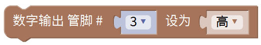
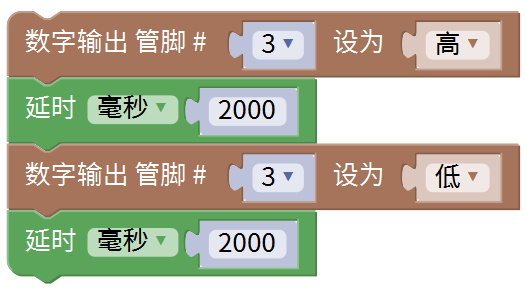
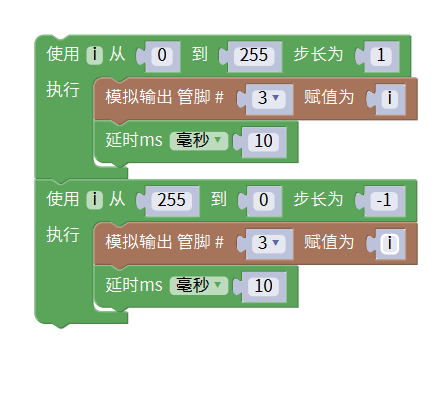

# Mixly

## 1. Mixly简介  

Mixly是一个可视化编程环境，专为Arduino及其他微控制器设计，旨在提供易于使用的界面，帮助初学者和儿童轻松学习编程和电子学基础。通过拖放编程块，用户可以快速构建程序，实现各类电子项目，无需深入理解复杂的代码语法。  

Mixly的用户界面直观友好，设计灵活，支持Scratch-style的图形化编程，适合各个年龄段的学习者。除了Arduino平台，Mixly还兼容多种开发板，让用户尽情探索不同的硬件功能。  

该平台提供了丰富的教程和示例，使用户能够迅速上手。Mixly同时支持C语言代码的生成，允许在完成图形化编程后，用户进一步学习或修改生成的代码，深化对编程的理解。  

## 2. 连接图  

  

## 3. 测试代码（Mixly实现LED闪烁）  

在Mixly中，可以通过以下步骤实现LED闪烁的代码：  

1. 在输入/输出栏拖出数字输出模块，将管脚设置为3，并选择电平为高，以打开LED。  

  

2. 在控制栏目里拖出延时模块，并将设置值改为2000毫秒（2秒）。  

  

3. 在输入/输出栏拖出另一个数字输出模块，将管脚设置为3，并选择电平为低，以熄灭LED。  

  

4. 再添加一个延时2000毫秒的模块。  

  

5. 最终的代码结构如下所示：  

  

## 4. 测试结果  

完成代码上传并连接线路后，上电后，LED会闪烁，每闪亮2秒，熄灭2秒，循环交替。这一简单的项目演示了LED控制的基本原理，使初学者能够实际感受到编程的效果。  

## 5. 加强训练（呼吸灯）  

在这一训练中，将使用PWM（脉宽调制）技术来控制LED的亮度，模拟出呼吸灯的效果。PWM技术通过快速开启与关闭电源来调节LED的亮度，使输出效果更为平滑。  

首先，将连接线从开发板的数字口2换到数字口3。数字口3前面的波浪线“~”表示该引脚支持PWM。  

## 6. PWM控制代码（Mixly实现呼吸灯效果）  

在Mixly中，呼吸灯的实现步骤如下：  

1. 设置引脚为PWM输出。  
2. 利用循环结构，通过逐渐增加和减少PWM值，控制LED的亮度。  

  

## 7. 结果  

当代码上传后，LED会逐渐由暗变亮，再由亮变暗，模拟出呼吸灯的效果。通过这种方式，用户不仅可以体验到编程的乐趣，还可以深入理解PWM调制的基本原理。

