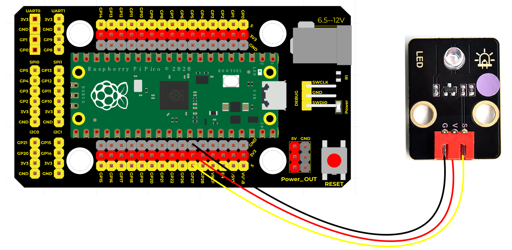

# Python


## 1. Python简介  

Python是一种高级编程语言，以其简洁、易读的语法而闻名。它支持多种编程范式，包括面向对象编程、过程式编程和函数式编程。得益于其强大的标准库和众多第三方库，Python在数据科学、机器学习、Web开发、自动化脚本、网络编程等领域得到了广泛应用。Python的简洁语法使得新手能够快速上手，因此它被广泛用于教育和开发中。  

Python的核心特点包括：  
- **简洁易读**：代码结构清晰，容易理解和维护。  
- **跨平台**：支持多种操作系统，包括Windows、macOS和Linux，使得Python程序能够在不同环境中运行。  
- **丰富的生态系统**：拥有大量的第三方库和框架，能加快开发过程，例如NumPy、Pandas、Flask和Django等。  
- **强大的社区支持**：Python拥有一个活跃的开发者社区，提供大量的学习资源和技术支持。  

## 2. 连接图  

  

## 3. 测试代码（LED闪烁）  

以下是使用Python和MicroPython的测试代码，控制Pico板上的LED闪烁：  

```python  
import machine  
import utime  

led_onboard = machine.Pin(27, machine.Pin.OUT)  

while True:  
    led_onboard.value(1)  # 打开LED  
    utime.sleep(2)        # 延迟2秒  
    led_onboard.value(0)  # 关闭LED  
    utime.sleep(2)        # 延迟2秒  
```  

## 4. 代码介绍  

- **import machine**：此行代码导入了`machine`模块，该模块用于MicroPython与设备交互，如GPIO引脚的控制。  
- **import utime**：导入`utime`库，用于处理与时间相关的功能。  
- **led_onboard = machine.Pin(27, machine.Pin.OUT)**：配置引脚27为输出，用于控制LED的开关。  
- **utime.sleep(2)**：调用`utime`库的`sleep`函数，使程序延迟指定的秒数。  

## 5. 测试结果  

通过烧录上述代码并按照接线图连接，并上电后，LED模块上LED将闪烁，亮2秒，灭2秒，循环交替。  

## 6. 加强训练（呼吸灯）  

在该项目中，我们将使用PWM（脉宽调制）技术来控制LED的亮度，创建呼吸灯效果。PWM允许通过调节宽度来控制亮度，提供更细腻的亮度变化。  

以下是实现呼吸灯的代码：  

```python  
import utime  
from machine import Pin, PWM  

PWM_PulseWidth = 0  # 初始化PWM脉宽  

# 使用树莓派Pico板上LED，创建PWM对象pwm_LED  
pwm_LED = PWM(Pin(27))  

# 设置pwm_LED频率  
pwm_LED.freq(500)  

while True:  
    while PWM_PulseWidth < 65535:  # 循环条件为PWM_PulseWidth的值小于65535  
        PWM_PulseWidth += 50  # 每次循环都加50  
        utime.sleep_ms(1)  # 延时1ms  
        pwm_LED.duty_u16(PWM_PulseWidth)  # 给引脚赋值  

    while PWM_PulseWidth > 0:  # 循环条件为PWM_PulseWidth的值大于0  
        PWM_PulseWidth -= 50  # 每次循环都减50  
        utime.sleep_ms(1)  # 延时1ms  
        pwm_LED.duty_u16(PWM_PulseWidth)  # 给引脚赋值  
```  

## 7. 结果  

上传代码后，LED将逐渐由暗变亮，然后再由亮变暗，形成呼吸灯效果。若未实现该功能，请检查LED的S端是否接在27脚。该项目让用户体验到编程与电子设备交互的乐趣，同时加深对PWM调制原理的理解。


